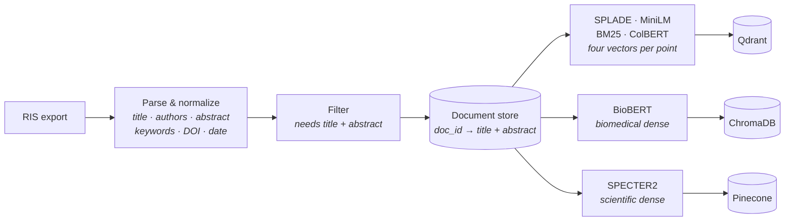

# SSNanopore-RAG

> A **local-first** Retrieval-Augmented Generation system for the **solid-state nanopore**
> literature — ask questions about nanopore sequencing, biophysics, and electronics and get
> answers grounded in real papers, with citations, running entirely on your own machine.

Point it at a bibliography export and you get an interactive chat session in which every factual
claim traces back to a retrieved abstract. Retrieval uses **HyDE** query expansion, **three
independent vector stores** fused by reciprocal rank, and a **cross-encoder** for final ordering.

---

## 🔑 Local-first, by design

Embedding, vector search, reranking, and the language model all run on your hardware. Cloud
services are strictly *opt-in* and never required.

| Stage            | Local default                                  | Optional cloud |
| ---------------- | ---------------------------------------------- | -------------- |
| **Embeddings**   | SPECTER2, BioBERT, SPLADE, MiniLM (on-device)  | Google Gemini  |
| **Vector store** | Qdrant + ChromaDB + Pinecone, all self-hosted  | —              |
| **Reranking**    | BM25, ColBERT, cross-encoder (on-device)       | —              |
| **LLM**          | Any tool-calling model on Ollama               | —              |

- 🔒 **Private** - Your documents and questions never leave your machine.
- 💸 **No keys, no bills** - No API signups, no per-token costs, no rate limits.
- 🔁 **Reproducible & offline** - Local stores and pinned models work without a network.
- 🧪 **Hackable** - Embeddings, stores, and retrieval strategies sit behind swappable interfaces.

---

## 🧭 How it works

### Ingest - Once Per Corpus



Each store decides for itself how a document is framed for indexing, and some index the same
document under more than one framing, a query then gets several chances to match it. Every point
carries the same `doc_id` regardless, so all three stores end up voting on the same documents.
Stores that keep multiple copies also return multiple ranked entries per document, which is
compensated for at fusion time with proportional RRF weights.

### Query - Per Question


---

## 💡 The two ideas worth stealing

### 1. The model guesses before it searches (HyDE)

A raw user question makes a poor dense-retrieval query. *"What is the average read length?"* is
short, under-specified, and shares almost no vocabulary with the abstracts that answer it - questions and answers simply do not look alike in embedding space.

So the model is asked to write a **hypothetical answer** from its own knowledge first, and *that
paragraph* becomes the search query. It is long, full of the right domain terms, and shaped like
the documents being searched, so it lands much closer to real abstracts. This is
**HyDE** (Hypothetical Document Embeddings,
[Gao et al., 2022](https://arxiv.org/abs/2212.10496)).

The draft is never shown to the user and never treated as fact. It can be entirely wrong and still
do its job, because its only purpose is to point the retriever in the right direction. The tool
schema enforces the order: the draft must be passed to the retriever **verbatim**, and the model
is instructed not to edit it.

### 2. Three retrievers vote, then one referee decides

Each store is good at something the others are not, SPLADE learns lexical expansion, BioBERT
knows biomedical phrasing, SPECTER2 knows how scientific papers relate to one another. Rather than
picking a winner, all three run and their **ranked lists** are fused with weighted Reciprocal Rank
Fusion, so a document that several retrievers like independently rises to the top:

$$\text{score}(d) = \sum_{r \in \text{retrievers}} \frac{w_r}{k + \text{rank}_r(d)}$$

Fusion is cheap because it uses only rank positions, scores from different stores are not
comparable, so it never tries to compare them. The survivors then go to a **cross-encoder**, which
reads the query and document *together* rather than embedding them separately. That is far more
accurate and far too slow to run over a whole corpus, which is exactly why it sits behind the
fusion step, scoring 30 candidates instead of thousands.

---

## 🧱 What's inside

### Bibliography ingestion
Parses RIS exports into structured records: title, authors, abstract, keywords, DOI, URL,
publisher, date. Records are split on end-of-record markers, so field order within an entry does
not matter and repeated fields (every author, every keyword) are preserved. Entries without a
usable title *and* abstract are dropped.

### Pluggable embeddings & ranking models

| Model             | Role     | Local | Notes                                                             |
| ----------------- | -------- | :---: | ----------------------------------------------------------------- |
| **SPECTER2**      | dense    | ✅    | Scientific-paper embeddings (`allenai/specter2`).                  |
| **BioBERT**       | dense    | ✅    | Biomedical language model (`dmis-lab/biobert-v1.1`).               |
| **MiniLM**        | dense    | ✅    | Lightweight general-purpose sentence embeddings (`sentence-transformers/all-MiniLM-L6-v2`).                   |
| **SPLADE**        | sparse   | ✅    | Learned sparse lexical expansion (`naver/splade-v3`).              |
| **BM25**          | lexical  | ✅    | Classic IDF term scoring, computed locally via fastembed.          |
| **ColBERT**       | reranker | ✅    | Late-interaction reranking inside Qdrant (`"answerdotai/answerai-colbert-small-v1`)                          |
| **Cross-encoder** | reranker | ✅    | Final scoring (`cross-encoder/ms-marco-MiniLM-L-6-v2`).            |
| **Gemini**        | dense    | ☁️    | Hosted Google embeddings (optional, needs an API key)             |

### Vector stores & retrieval strategies
Multiple stores behind a single `add_embeddings` / `query` interface, so strategies can be
compared on the same corpus without rewriting the pipeline:

| Strategy            | What it does                                                     |
| ------------------- | ---------------------------------------------------------------- |
| **Dense**           | Semantic search                          |
| **Sparse (SPLADE)** | Learned sparse lexical retrieval.                                |
| **BM25**            | Classic IDF-weighted lexical search.                             |
| **Hybrid**          | Dense + sparse, fused with RRF.                                  |
| **Rerank**          | Candidates from dense + sparse + BM25, reordered by **ColBERT**. |

Backends: **Qdrant** (server; all five strategies, cosine), **ChromaDB** (on-disk dense,
HNSW/cosine), and **Pinecone** (self-hosted `pinecone-local`, dense, Euclidean).

### Local LLM
A chat wrapper around [**Ollama**](https://ollama.com/) with a multi-step tool-calling loop, live
streaming of both reasoning and answer, and a system prompt tuned for nanoscience. Tool failures
are handed back to the model as text so it can recover instead of crashing the turn, and the loop
is bounded so a model that keeps calling tools still returns an answer.

---

## 🚀 Getting started

### Prerequisites

- **Python 3.13+** and [**uv**](https://github.com/astral-sh/uv)
- [**Ollama**](https://ollama.com/) running locally, with a tool-calling model pulled (recommended: `gemma4:latest`)
- **Docker** - **required**. Qdrant and Pinecone both run as local containers.
- **A CUDA GPU** - optional but recommended. A CUDA build of PyTorch is pinned in
  `pyproject.toml`; adjust it for a CPU-only machine.

### 1. Install

```bash
uv sync
```

### 2. Start the vector stores

```bash
docker compose --profile qdrant --profile pinecone up -d
```

Qdrant listens on `localhost:6333`, Pinecone-local on `localhost:5080`.

### 3. Pull a model

```bash
ollama pull <your-model>
```

Any chat model with tool-calling support. The pipeline leans on tools heavily, so a model with
weak tool adherence will underperform regardless of its size.

### 4. Check your setup

```bash
uv run main init
```

Clears the on-disk vector store and verifies both containers are reachable, printing the exact
command to run if either is missing.

### 5. Build the index

```bash
uv run main prepare <path-to-your-export.ris>
```

Accepts `.ris` (parsed first) or an already-parsed `.json`. Add an optional second argument to cap
the document count, worth doing for a quick trial run before committing to a full corpus. This
**resets all three stores** and rebuilds them from scratch.

### 6. Ask questions

```bash
uv run main run <your-ollama-model>
```

Starts the interactive chat loop.

| Command  | Effect                                            |
| -------- | ------------------------------------------------- |
| `/debug` | Dump the raw message history                      |
| `/tools` | Show the tool schemas given to the model          |
| `/clear` | Reset the conversation, keeping the system prompt |
| `/quit`  | Exit (a blank line also exits)                    |

> ℹ️ **Optional cloud:** to use the hosted embedding backend, put an API key in a local `.env`
> file - it is picked up automatically. Everything else runs fully offline.

---

## 🩺 Troubleshooting

| Symptom | Cause |
| ------- | ----- |
| `init` says a service is unreachable | The container isn't up. Run the Compose command it prints. |
| Queries fail after a Docker restart | Compose declares no volumes, so recreating a container drops its data. Rerun `prepare`. |
| Model answers without citing anything | It skipped the retrieval tool. Try a model with stronger tool-calling adherence. |
| First run stalls before answering | Embedding and reranker weights are downloading from HuggingFace. One-time cost. |
| `NO_SUCHFILE` loading a `.onnx` model | fastembed caches BM25/ColBERT/MiniLM weights in the system temp directory, which the OS is free to clear leaving a cache that looks present but is empty. Clear it and it re-downloads on the next run: `Remove-Item -Recurse -Force "$env:TEMP\fastembed_cache"` (PowerShell), or `rm -rf /tmp/fastembed_cache` elsewhere. |
| Ingestion keeps far fewer papers than expected | Entries without both a title and an abstract are dropped, RIS exports are often abstract-free. |

---

## 🧰 Major packages

**PyTorch** + **HuggingFace Transformers**/**adapters** (on-device embedding models) ·
**qdrant-client** with **fastembed** (vector store, BM25, ColBERT) · **ChromaDB** · **Pinecone** ·
**sentence-transformers** (cross-encoder reranking) · **Ollama** · **Pydantic** ·
**Typer** + **Rich** (CLI and streaming UI) · **google-genai** (optional) ·
**uv**, **ruff**, **black**, **pre-commit**

---

## 📌 Status & notes

- **Storage is not durable across container restarts** - the Compose file declares no volumes.
- Embedding models currently run on CPU one document at a time, which makes ingestion the slowest
  part of the pipeline by a wide margin. Deliberate for now: it keeps the GPU free for the LLM.
- **Pinecone runs against two upstream bugs I filed**, both worked around locally:
  - [pinecone-io/python-sdk#678](https://github.com/pinecone-io/python-sdk/issues/678) -
    `pinecone-local` advertises an `https://` data-plane host it cannot serve. Worked around by
    disabling SSL verification and rewriting the returned host to `http://`.
  - [pinecone-io/python-sdk#679](https://github.com/pinecone-io/python-sdk/issues/679) - sparse
    index creation is impossible against `pinecone-local`, so Pinecone is **dense-only** here and
    the sparse store is disabled. The Qdrant sparse/hybrid/rerank stores cover that ground.
