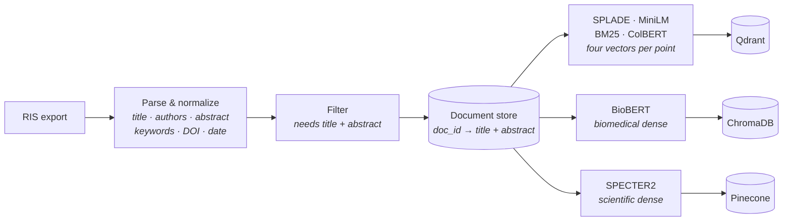
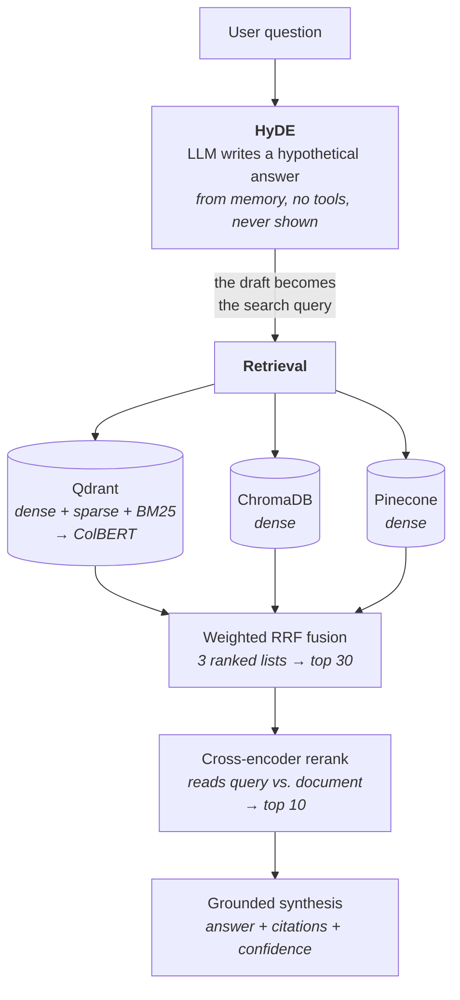

# Fusion RAG

> A **fully local** Retrieval-Augmented Generation system. Point it at your own document
> collection, ask questions in a chat loop, and get answers grounded in what you indexed, with
> citations, on your own hardware, with no API keys.

The interesting part isn't the chat loop, it's the retrieval stack behind it: **HyDE** query
expansion, **three independent vector stores** fused by reciprocal rank, and a **cross-encoder**
that reorders the finalists.

---

## Why local

Embedding, vector search, reranking, and the LLM all run on your machine. Cloud is strictly
opt-in and never required.

| Stage            | Local default                                 | Optional cloud |
| ---------------- | --------------------------------------------- | -------------- |
| **Embeddings**   | SPECTER2, BioBERT, SPLADE, MiniLM, BM25       | Google Gemini  |
| **Vector store** | Qdrant + ChromaDB + Pinecone, all self-hosted | none           |
| **Reranking**    | ColBERT, cross-encoder                        | none           |
| **LLM**          | Any tool-calling model on Ollama              | none           |

- **Private.** Documents and questions never leave the machine.
- **No keys, no bills.** No signups, no per-token costs, no rate limits.
- **Reproducible.** Local stores and pinned models work offline.
- **Swappable.** Embeddings, stores, and retrieval strategies sit behind common interfaces.

---

## How it works

### Ingest, once per corpus



Each store decides for itself how to frame a document for indexing, and some index the same
document more than one way, so a query gets several chances to match it. Every point carries the
same `doc_id`, so all three stores end up voting on the same documents. Stores that keep multiple
copies return multiple ranked entries per document, which is compensated for at fusion time with
proportional RRF weights.

### Query, per question



---

## The two design decisions that matter

### 1. Guess the answer before searching for it

A raw question makes a bad dense-retrieval query. *"What is the average read length?"* is short,
under-specified, and shares almost no vocabulary with the text that answers it. Questions and
answers simply don't look alike in embedding space.

So the model writes a **hypothetical answer** from its own knowledge first, and *that paragraph*
becomes the search query. It's long, full of the right domain terms, and shaped like the documents
being searched, so it lands much closer to the real ones. This is
[HyDE](https://arxiv.org/abs/2212.10496).

The draft is never shown to the user and never treated as fact. It can be completely wrong and
still do its job, because its only purpose is to aim the retriever. The tool schema enforces the
order: the draft goes to the retriever **verbatim**, and the model is told not to edit it.

### 2. Three retrievers vote, one referee decides

Each store is good at something the others aren't. SPLADE does lexical expansion, BioBERT knows
biomedical phrasing, SPECTER2 knows how documents relate to each other. Instead of picking a
winner, all three run and their **ranked lists** are fused with weighted Reciprocal Rank Fusion,
so a document that several retrievers like independently rises to the top.

Fusion uses only rank positions, never raw scores. Scores from different stores aren't comparable,
so it doesn't try to compare them. The survivors go to a **cross-encoder**, which reads query and
document *together* instead of embedding them separately. That's far more accurate and far too slow
to run over a whole corpus, which is exactly why it sits behind fusion, scoring 30 candidates
instead of thousands.

---

## What's inside

### Ingestion

Input is **RIS**, the tagged plain-text format that reference managers and academic databases
(Zotero, Mendeley, EndNote, PubMed, Scopus, Web of Science) export. One file gives you a whole
corpus, which is why it's the entry point here. A RIS file is a flat sequence of records.
Each line is a two-letter tag, two spaces, a hyphen, a space, then the value.

The parser pulls out title, authors, abstract, keywords, DOI, URL, publisher, and date. Two quirks
of the format drive the implementation: values wrap across untagged continuation lines, so those
get folded back into the value they belong to instead of truncating the abstract, and tag order
inside a record isn't guaranteed, so records are split on title lines and accumulate whatever tags
follow rather than assuming a fixed layout.

Surviving records become normalized documents keyed by a generated `doc_id`. A record is dropped
unless it has both a title and an abstract of at least 30 characters, since a bare title gives the
embedding models nothing to work with.

### Pluggable embedding & ranking models

| Model             | Role     | Local | Notes                                                                 |
| ----------------- | -------- | :---: | --------------------------------------------------------------------- |
| **SPECTER2**      | dense    |  ✅   | Scientific-document embeddings (`allenai/specter2`)                    |
| **BioBERT**       | dense    |  ✅   | Biomedical language model (`dmis-lab/biobert-v1.1`)                    |
| **MiniLM**        | dense    |  ✅   | Lightweight general sentence embeddings (`all-MiniLM-L6-v2`)           |
| **SPLADE**        | sparse   |  ✅   | Learned sparse lexical expansion (`naver/splade-v3`)                   |
| **BM25**          | lexical  |  ✅   | Classic IDF term scoring, computed locally via fastembed               |
| **ColBERT**       | reranker |  ✅   | Late-interaction reranking inside Qdrant (`answerai-colbert-small-v1`) |
| **Cross-encoder** | reranker |  ✅   | Final scoring (`cross-encoder/ms-marco-MiniLM-L-6-v2`)                 |
| **Gemini**        | dense    |  ☁️   | Hosted Google embeddings (optional, needs an API key)                  |

### Vector stores & retrieval strategies

Multiple stores behind one `add_embeddings` / `query` interface, so strategies can be compared on
the same corpus without rewriting the pipeline:

| Strategy            | What it does                                                    |
| ------------------- | --------------------------------------------------------------- |
| **Dense**           | Semantic search                                                  |
| **Sparse (SPLADE)** | Learned sparse lexical retrieval                                 |
| **BM25**            | Classic IDF-weighted lexical search                              |
| **Hybrid**          | Dense + sparse, fused with RRF                                   |
| **Rerank**          | Candidates from dense + sparse + BM25, reordered by **ColBERT**  |

Backends: **Qdrant** (server; all five strategies, cosine), **ChromaDB** (on-disk dense,
HNSW/cosine), and **Pinecone** (self-hosted `pinecone-local`, dense, Euclidean).

### Local LLM

A chat wrapper around [Ollama](https://ollama.com/) with a multi-step tool-calling loop and live
streaming of both reasoning and answer. Tool failures are handed back to the model as text so it
can recover instead of crashing the turn, and the loop is bounded so a model that keeps calling
tools still returns an answer.

---

## Getting started

### Prerequisites

- **Python 3.13+** and [uv](https://github.com/astral-sh/uv)
- [Ollama](https://ollama.com/) running locally with a tool-calling model pulled
  (recommended: `gemma4:latest`)
- **Docker**, required. Qdrant and Pinecone both run as local containers.
- **A CUDA GPU**, optional but recommended. A CUDA build of PyTorch is pinned in `pyproject.toml`;
  adjust it for a CPU-only machine.

### 1. Install

```bash
uv sync
```

### 2. Start the vector stores

```bash
docker compose --profile qdrant --profile pinecone up -d
```

Qdrant listens on `localhost:6333`, Pinecone-local on `localhost:5080`.

### 3. Pull a model

```bash
ollama pull <your-model>
```

Any chat model with tool-calling support. The pipeline leans on tools heavily, so a model with weak
tool adherence will underperform regardless of size.

### 4. Check the setup

```bash
uv run main init
```

Clears the on-disk vector store and verifies both containers are reachable, printing the exact
command to run if either is missing.

### 5. Build the index

```bash
uv run main prepare <path-to-your-export.ris>
```

Accepts `.ris` (parsed first) or an already-parsed `.json`. An optional second argument caps the
document count, worth doing for a quick trial run before committing to a full corpus. This
**resets all three stores** and rebuilds them from scratch.

### 6. Ask questions

```bash
uv run main run <your-ollama-model>
```

Starts the interactive chat loop.

| Command  | Effect                                            |
| -------- | ------------------------------------------------- |
| `/debug` | Dump the raw message history                      |
| `/tools` | Show the tool schemas given to the model          |
| `/clear` | Reset the conversation, keeping the system prompt |
| `/quit`  | Exit (a blank line also exits)                    |

> **Optional cloud:** to use the hosted embedding backend, put an API key in a local `.env` file.
> It's picked up automatically. Everything else runs fully offline.

---

## Troubleshooting

| Symptom | Cause |
| ------- | ----- |
| `init` says a service is unreachable | The container isn't up. Run the Compose command it prints. |
| Queries fail after a Docker restart | Compose declares no volumes, so recreating a container drops its data. Rerun `prepare`. |
| Model answers without citing anything | It skipped the retrieval tool. Try a model with stronger tool-calling adherence. |
| First run stalls before answering | Embedding and reranker weights are downloading from HuggingFace. One-time cost. |
| `NO_SUCHFILE` loading a `.onnx` model | fastembed caches BM25/ColBERT/MiniLM weights in the system temp directory, which the OS is free to clear, leaving a cache that looks present but is empty. Clear it and it re-downloads: `Remove-Item -Recurse -Force "$env:TEMP\fastembed_cache"` (PowerShell), or `rm -rf /tmp/fastembed_cache` elsewhere. |
| Ingestion keeps far fewer documents than expected | Entries without both a title and an abstract are dropped, and RIS exports are often abstract-free. |

---

## Stack

**PyTorch** + **HuggingFace Transformers**/**adapters** (on-device embedding models) ·
**qdrant-client** with **fastembed** (vector store, BM25, ColBERT) · **ChromaDB** · **Pinecone** ·
**sentence-transformers** (cross-encoder reranking) · **Ollama** · **Pydantic** ·
**Typer** + **Rich** (CLI and streaming UI) · **google-genai** (optional) ·
**uv**, **ruff**, **black**, **pre-commit**

---

## Known limitations

- **Storage isn't durable across container restarts.** The Compose file declares no volumes.
- Embedding models run on CPU, one document at a time, which makes ingestion the slowest part of
  the pipeline by a wide margin. Deliberate for now: it keeps the GPU free for the LLM.
- **Pinecone runs against two upstream bugs I reported**, both worked around locally:
  - [pinecone-io/python-sdk#678](https://github.com/pinecone-io/python-sdk/issues/678):
    `pinecone-local` advertises an `https://` data-plane host it can't serve. Worked around by
    disabling SSL verification and rewriting the returned host to `http://`.
  - [pinecone-io/python-sdk#679](https://github.com/pinecone-io/python-sdk/issues/679): sparse
    index creation is impossible against `pinecone-local`, so Pinecone is **dense-only** here and
    the sparse store is disabled. The Qdrant sparse/hybrid/rerank stores cover that ground.
